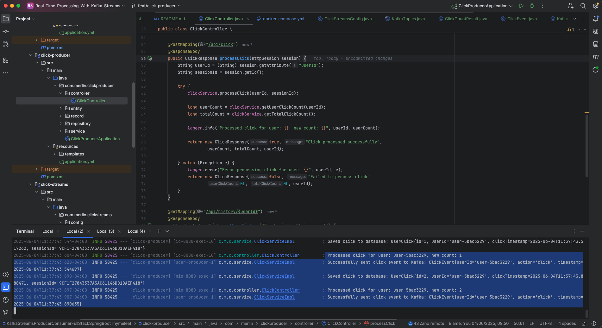

# Calculating the number of clicks with Kafka Streams and Spring Boot Full-Stack Application With Thymeleaf


## Create required topics (Topic are automatically created when you run all applications, but if not, use these command)
```shell
# If Kafka-broker is not yet deployed, use this command:
# cd infra
# docker-compose -f common.yml -f docker-compose.yml up -d

#docker exec -it kafka-broker-1 bash
#cd
#kafka-topics --bootstrap-server localhost:9092 --create --topic weather-data --replication-factor 1 --partitions 1
#kafka-topics --bootstrap-server localhost:9092 --create --topic station-averages --replication-factor 1 --partitions 1
#
#kafka-topics --bootstrap-server localhost:9092 --list
```


## Run all Modules

### Terminal 1 - Start the Click Producer
```shell
cd click-producer
mvn spring-boot:run
````


### Terminal 2 - Start the Streams Application
```shell
cd click-streams
mvn spring-boot:run
```


# Terminal 3 - Start the Consumer API

```shell
cd click-consumer
mvn spring-boot:run
```


## URLs:
- H2 Database url: http://localhost:8080/h2-console
- Click Producer Url: http://localhost:8080/
- Kafka UI URL: http://localhost:8084
- Consumer REST URL for Global Click: http://localhost:8082/api/clicks/count
- Consumer REST Statistique(number of user + total clicks): http://localhost:8082/api/clicks/stats

### Producer and Thymeleaf Web UI: http://localhost:8080/


1. Click on the button and view result


2. Click Producer




3. Click-streams


4. Click Consumer:

- console log
  

- REST Endpoints: http://localhost:8082/api/clicks/count
  

5. Kafka UI on AKHQ: http://localhost:8084

- click topic
  

- click-count topic
  

# The Architecture Overview: From Click to Count
Our system is designed around the concept of event-driven architecture, where user actions trigger a cascade of events that flow through different components like water flowing through a carefully designed canal system. Each component is responsible for one specific aspect of the overall process, which makes the system both scalable and maintainable.

## The User Experience Layer (Click Producer)
The journey begins when a user opens their web browser and visits our application running on port 8080. This is our **Click Producer module**, built with Spring Boot and Thymeleaf. Think of this as the `front desk` of our entire system - it's where all the action starts.

When a user clicks the button on our web page, several things happen simultaneously. The ClickController receives the HTTP POST request and immediately coordinates two important operations. First, it saves the click information to a local H2 database for immediate consistency and local backup. This ensures we never lose a click, even if something goes wrong with our streaming system.

Second, and more importantly for our event-driven architecture, the ClickService transforms this user action into a **ClickEvent** object and publishes it to Kafka. This is where the magic of **event-driven systems** begins - we're not just storing data, we're creating an event that announces `something happened` to the rest of our system.

The beauty of using the userId as the Kafka message key is that it ensures all clicks from the same user will always go to the same partition. This maintains the order of events for each user, which is crucial for accurate counting and processing.

## The Message Highway (Kafka Cluster)
The Kafka cluster sits at the heart of our architecture like a sophisticated postal system. It consists of two main topics that serve different purposes in our event flow.

The **clicks topic** receives the raw click events from our producer. Think of this as the "inbox" where all user actions are first recorded. We've configured this topic with 3 partitions, which means we can handle multiple users simultaneously without bottlenecks. Each partition can be processed independently, allowing our system to scale horizontally as traffic increases.

The **click-counts topic** is where the processed results are published. This is like the `outbox` where our Kafka Streams application sends the calculated results after processing the raw click events.

What makes Kafka particularly powerful for our use case is its ability to replay events. If we need to reprocess our data or if a component fails and needs to catch up, Kafka can replay all the events from any point in time. This provides incredible resilience and flexibility to our system.

## The Processing Engine (Kafka Streams)

The Kafka Streams application is perhaps the most intellectually interesting part of our architecture. Running on port 8081, this component continuously processes the stream of click events in real-time, transforming raw user actions into meaningful aggregated data.

Here's where the concept of **stream processing** really shines. Instead of waiting to collect a batch of data and then processing it (like traditional batch processing), our Streams application processes each click event as it arrives. It maintains running counts in what's called a **KTable** - think of this as an ever-updating spreadsheet where each row represents a user and their current click count.

The Stream Processor reads from the clicks topic, groups the events by userId, and continuously updates the running count for each user. Every time the count changes, it publishes the new result to the click-counts topic. This creates a real-time view of user activity that's always current.

The State Store component provides local storage for these running totals, which allows the Streams application to maintain state even if it needs to restart. This is crucial for maintaining accuracy in our counts.

## The API Service (Click Consumer)

Our final component, the Click Consumer running on port 8082, serves as the bridge between our event-driven backend and external systems that need access to our click count data. This application subscribes to the click-counts topic and maintains its own local copy of the latest counts in an H2 database.

The CountController exposes a REST API endpoint at `/clicks/count` that external systems can call to get real-time click counts. This design pattern is particularly powerful because it decouples the systems that need the data from the systems that process the data. The REST API can serve thousands of requests per second without impacting our stream processing performance.

The CountService continuously updates the local database as new count results arrive from Kafka, ensuring that API responses are always fast (since they're served from a local database) and current (since they're updated in real-time from the stream).

## Multi-Module Design

Our multi-module Maven structure brings several important benefits that become more apparent as systems grow in complexity. The **kafka-broker** module serves as our shared foundation, containing all the common configuration and data models that the other modules need. This prevents code duplication and ensures consistency across all components.

Each application module (click-producer, click-streams, click-consumer) can be developed, tested, and deployed independently. This is crucial for maintaining large systems because different teams can work on different modules without stepping on each other's toes.

The separation also allows for different scaling strategies. If we suddenly get a lot more web traffic, we can scale up just the click-producer instances. If we need more processing power for counting, we can scale up just the click-streams instances. This granular control over resources is much more efficient than scaling monolithic applications.

## Event-Driven Architecture Benefits

This architecture demonstrates several key principles of event-driven systems that make them particularly suitable for modern applications. The **loose coupling** between components means that each service only needs to know about the events it cares about, not about the internal workings of other services.

The **asynchronous communication** through Kafka means that our web application never has to wait for the counting to complete before responding to the user. This keeps the user experience fast and responsive, even under heavy load.

The **event sourcing** aspect means we have a complete audit trail of every user action. If we ever need to debug an issue or implement new features that require historical data, we can replay the events from Kafka to reconstruct any state we need.

This architecture also supports **eventual consistency** - while each component maintains its own local view of the data, all components will eventually converge to the same state as events flow through the system. This trade-off between immediate consistency and system performance is often worth making in distributed systems.

The entire system demonstrates how modern microservices can work together through well-defined event contracts to create sophisticated functionality that's both scalable and maintainable. Each component does one thing well, and the composition of these components creates powerful emergent behavior that would be difficult to achieve with a monolithic approach.


# Delete Kafka Broker deployment
```shell
cd infra # If not yet in that directory
docker-compose -f common.yml -f docker-compose.yml down -v
```