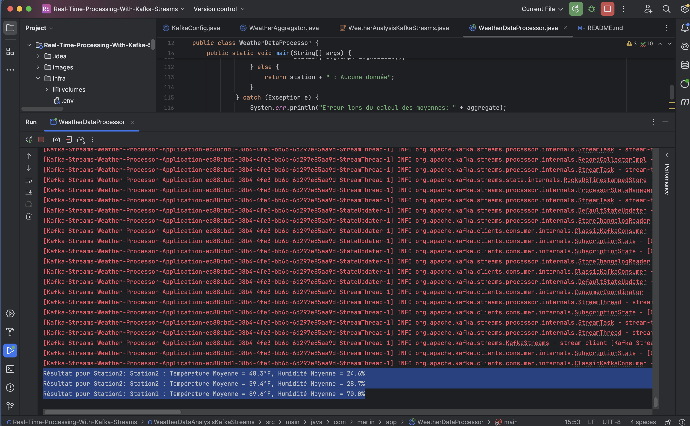

# Real Time Processing With Kafka Streams for Java Development

- Le dossier `infra` contient le fichier docker-compose pour deployer un `cluster kafka` en local
- Le dossier `WeatherDataAnalysisKafkaStreams` contient le projet Java sur l'`Analyse de Données Météorologiques`
- Le dossier `WeatherDataAnalysisKafkaStreams` contient le projet Java sur `Calcul du nombre de clics avec Kafka Streams et Spring Boot`

## Deploy Kafka Broker 
```shell
cd infra
docker-compose -f common.yml -f docker-compose.yml up -d
```

# 1 : Analyse de Données Météorologiques

## Create required topics
```shell
docker exec -it kafka-broker-1 bash
cd
kafka-topics --bootstrap-server localhost:9092 --create --topic weather-data --replication-factor 1 --partitions 1
kafka-topics --bootstrap-server localhost:9092 --create --topic station-averages --replication-factor 1 --partitions 1

kafka-topics --bootstrap-server localhost:9092 --list
```


## Execute application `WeatherDataProcessor`

1. Publication et lecture les données météo depuis le topic 'weather-data'.
### Producer
```shell
docker exec -it kafka-broker-1 bash
cd
kafka-console-producer --topic weather-data --bootstrap-server localhost:9092
```


2. Filtrer et transformer les relevés météorologiques a partir de l'application



3. Publier les moyennes de température et d'humidité par station dans le topic 'station-averages'.
### Consumer
```shell
docker exec -it kafka-broker-1 bash
cd
kafka-console-consumer --topic station-averages --bootstrap-server localhost:9092 --from-beginning
```


# 2 : Calcul du nombre de clics avec Kafka Streams et Spring Boot


# Delete Kafka Broker deployment
```shell
cd infra # If not yet in that directory
docker-compose -f common.yml -f docker-compose.yml down -v
```
