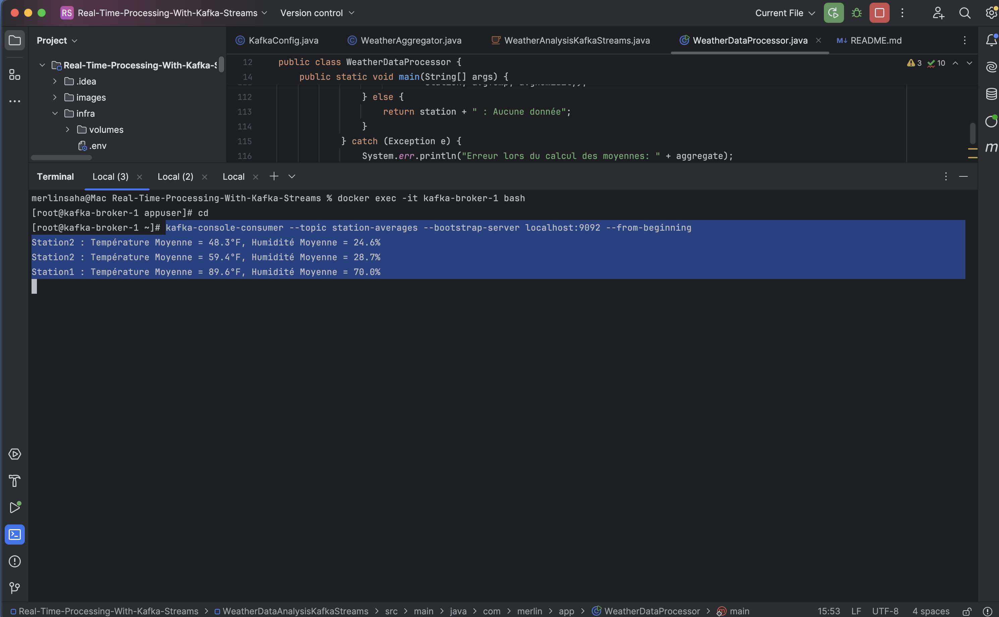

# Analyse de Données Météorologiques

Une entreprise collecte des données météorologiques en temps réel via Kafka. Chaque
station météorologique envoie des messages dans le topic Kafka nommé 'weather-data'. Les
messages ont le format suivant :
station,temperature,humidity
- station : L'identifiant de la station (par exemple, Station1, Station2, etc.).
- temperature : La température mesurée (en °C, par exemple, 25.3).
- humidity : Le pourcentage d'humidité (par exemple, 60).

## Create required topics
```shell
docker exec -it kafka-broker-1 bash
cd
kafka-topics --bootstrap-server localhost:9092 --create --topic weather-data --replication-factor 1 --partitions 1
kafka-topics --bootstrap-server localhost:9092 --create --topic station-averages --replication-factor 1 --partitions 1

kafka-topics --bootstrap-server localhost:9092 --list
```


## Execute application `WeatherDataProcessor`

1. Publication et lecture les données météo depuis le topic 'weather-data'.
# Producer
```shell
docker exec -it kafka-broker-1 bash
cd
kafka-console-producer --topic weather-data --bootstrap-server localhost:9092
```


2. Filtrer et transformer les relevés météorologiques a partir de l'application


3. Publier les moyennes de température et d'humidité par station dans le topic 'station-averages'.
# Consumer
```shell
docker exec -it kafka-broker-1 bash
cd
kafka-console-consumer --topic station-averages --bootstrap-server localhost:9092 --from-beginning
```


